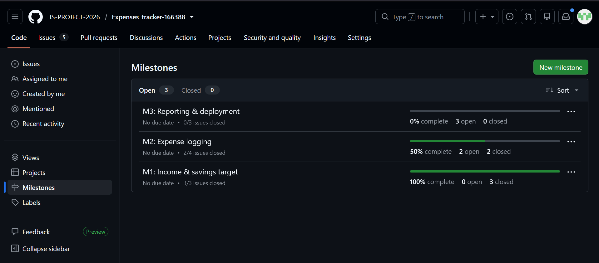
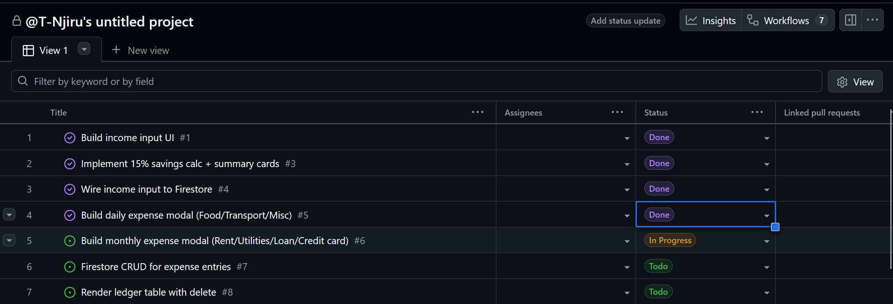
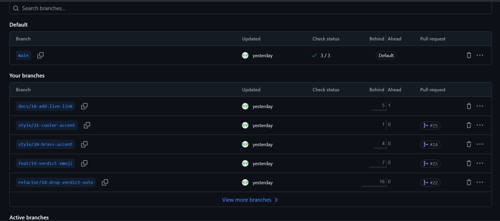
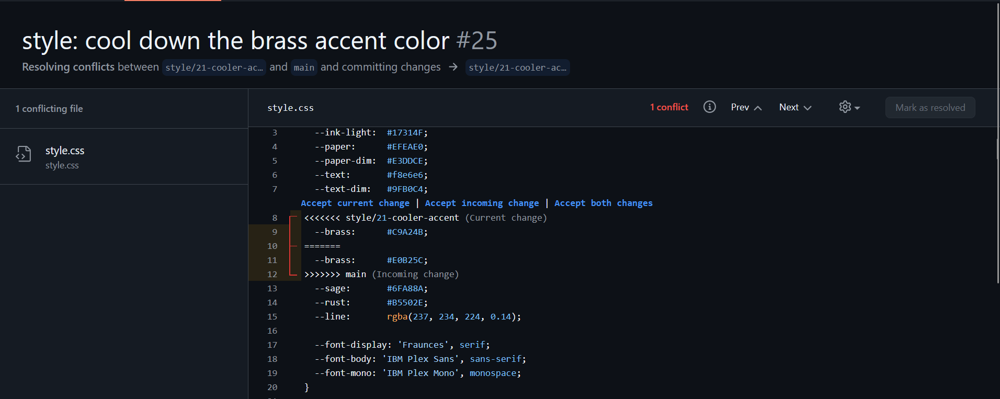
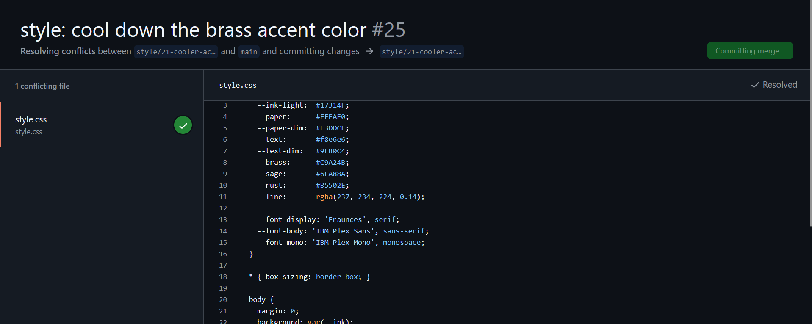
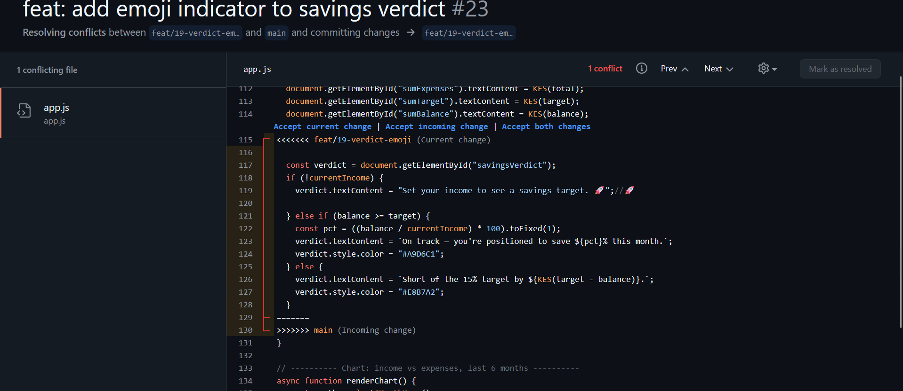
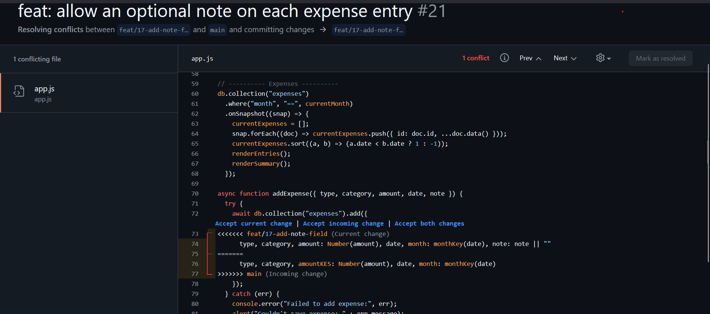

# Project Submission Report

## 1. Student Details

- **Full Name:** Ted Njiru
- **GitHub Username:** T-Njiru
- **Email:** ted.njiru@strathmore.edu

---

## 2. Deployed Project Link

- **Live GitHub Pages URL:** https://is-project-2026.github.io/Expenses_tracker-166388/

---

## 3. Reflection — Grounded in Your Git History

> Every answer must include a direct link to the specific commit, PR, issue, or branch that demonstrates it. No generic answers.

### A. Your Best Commit

- **Commit URL:** [https://github.com/IS-PROJECT-2026/Expenses_tracker-166388/commit/34eee56a4eb3c6d0e9f40508123a64e20f2a4435](https://github.com/IS-PROJECT-2026/Expenses_tracker-166388/commit/34eee56a4eb3c6d0e9f40508123a64e20f2a4435)
- **Why this one?** This is a chore commit created the basic structure of the project, including the HTML, CSS, and JavaScript files. It set up the initial layout and styling for the expenses tracker application, providing a solid foundation for further development. The commit message clearly describes the changes made, making it easy to understand the purpose of the commit.

### B. A Mistake or Struggle

- **Link to the evidence:** [https://github.com/IS-PROJECT-2026/Expenses_tracker-166388/commit/5007675c3b1b355db36660b2b4a17e62538295d2](https://github.com/IS-PROJECT-2026/Expenses_tracker-166388/commit/5007675c3b1b355db36660b2b4a17e62538295d2)
- **What happened and how did you recover?** I ran `git push origin main` instead of pushing the feature branch, and the branch never made it to the remote. Recovery: `git checkout style/20-brass-accent` (branch still existed locally with the commit intact) then `git push -u origin style/20-brass-accent`.

### C. A Pull Request You're Proud Of

- **PR URL:** [https://github.com/IS-PROJECT-2026/Expenses_tracker-166388/pull/12](https://github.com/IS-PROJECT-2026/Expenses_tracker-166388/pull/12)
- **What did you check before merging?** The issue was an induced merge conflict — the conflict was created by one branch deleting a code segment in `app.js` while the other branch was editing that same code segment. I checked the code to ensure that the final merged version had the correct functionality and that no important code was lost in the merge process.

### D. One Thing You Would Do Differently

- **What would you change?** I would have utilised more branches in the building of the project. I used one large commit after ensuring the code worked locally, then a single commit direct to `main` to push the code to remote. I would have created multiple branches for each feature or bug fix, allowing for better organization and easier collaboration with other team members.
- **Link to the evidence of the original decision:** [https://github.com/IS-PROJECT-2026/Expenses_tracker-166388/commit/34eee56a4eb3c6d0e9f40508123a64e20f2a4435](https://github.com/IS-PROJECT-2026/Expenses_tracker-166388/commit/34eee56a4eb3c6d0e9f40508123a64e20f2a4435)
---

## 4. Screenshots of Key GitHub Features

> Paste screenshots directly into this file via the GitHub web editor (click the blank line, Ctrl+V) so GitHub generates permanent hosted links — do not reference local file paths.

### A. Milestones and Issues

- **Caption:** Three milestones — M1 (Income & savings target), M2 (Expense logging), and M3 (Reporting & deployment) — each with their linked issues, showing the project broken into distinct development phases.

### B. Project Board

- **Caption:** The list of issues in the project board, with their respective status. The issues are categorized into To Do, In Progress, and Done columns, providing a clear overview of the project's progress and current tasks.

### C. Branching Architecture

- **Caption:** [] 

### D. Pull Requests & Traceability

- **Caption:** Added website link to README file, issue #11 in Milestone 3.

---

## 5. Merge Conflict Evidence

### Conflict 1 — Full Chronology

**What cause did you use?** Edit/Edit conflict — both branches (`style/20-brass-accent` and `style/21-cooler-accent`) changed the same `--brass` CSS variable line in `style.css` to different values.

#### Step 1: Generating the Clash

- **Caption:** Merged `style/21-cooler-accent` into `main` after `style/20-brass-accent` was already merged; Git flagged a conflict because both branches edited the same `--brass` variable.
The conflict markers showed the two competing values for `--brass` — one from each branch. `#B8934A` was kept, since it reads more clearly against the dark navy ledger background than the alternative.

#### Step 2: Resolution & Clean Merge

- **Caption:** After removing the conflict markers and keeping `#B8934A`, the merge completed and `git log --oneline --graph` shows both branches folded cleanly into `main`. The app was reloaded locally to confirm the accent color still rendered correctly across the summary cards and buttons.

---

### Conflict 2 — Different Cause

**What cause did you use?** Modify/Delete conflict — `refactor/18-drop-verdict-note` deleted the savings-verdict block inside `renderSummary()` in `app.js`, while `feat/19-verdict-emoji` concurrently edited that same block.

**Why does this cause trigger a conflict?** Git has no rule for whether a deletion or a concurrent edit should win, since neither branch's history reflects the other's change — it has to ask you to decide.

- **Caption:** The `HEAD` side showed the verdict block removed entirely by `refactor/18-drop-verdict-note`, while the incoming side from `feat/19-verdict-emoji` still had the block with an emoji prefix added. I kept the incoming version — the savings verdict is a core piece of user feedback, so deleting it outright wasn't the right call even though the branch that removed it merged first.

---

### Conflict 3 — Different Cause

**What cause did you use?** Divergent same-function conflict — `refactor/16-rename-amount-field` renamed `amount` to `amountKES` inside `addExpense()`, while `feat/17-add-note-field` independently added a new `note` field to the same object literal in the same function, both branched from `main` before either merged.

**Why does this cause trigger a conflict?** Both branches touch the same object-literal line for different, non-overlapping reasons — Git can't safely combine a field rename with a field addition on the same line without confirmation, even though the two changes aren't logically opposed.

- **Caption:** Resolved by keeping `amountKES` from branch 16 and adding `note: note || ""` from branch 17, plus updating the destructured parameters to include both.

---

## 6. Feedback & Evaluation

- [ ] **Anonymous Evaluation Form:** [Course & Instructor Evaluation](https://forms.gle/YLybnsyXXErKEg3s9)

---

## Final Submission

> **Submission Form:** [https://forms.gle/KrT4VxtFtkU3wtYu8](https://forms.gle/KrT4VxtFtkU3wtYu8)
